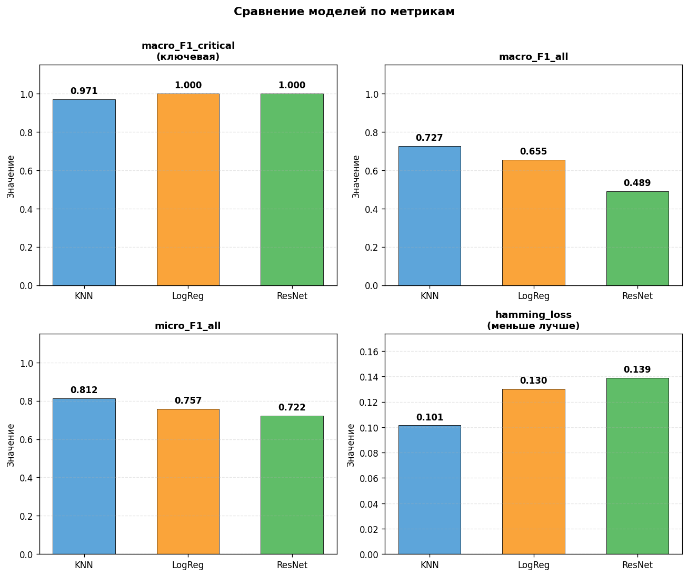
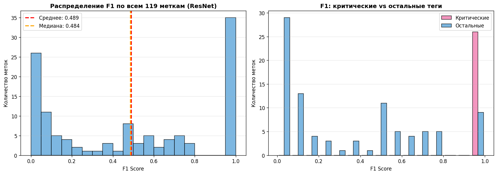
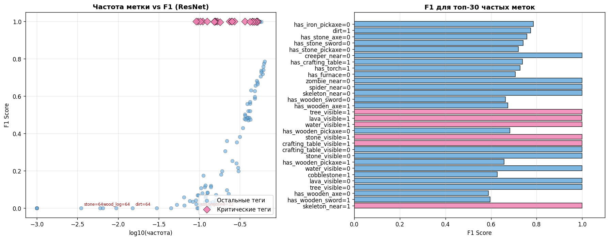
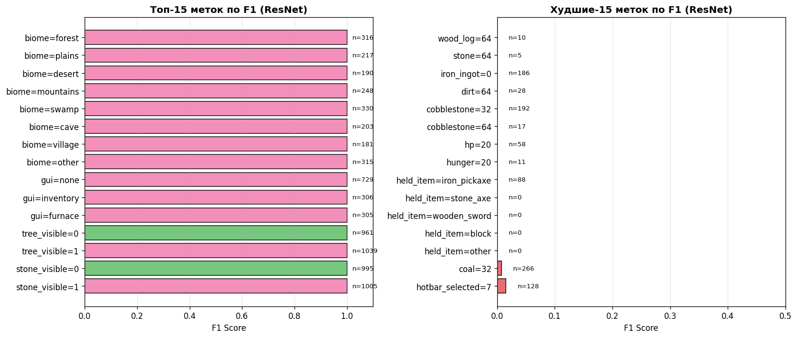
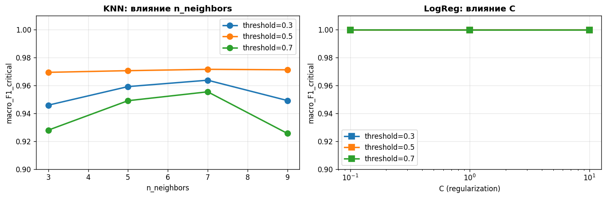

# Чекпоинт №3

# Отчет по vision-модулю для Minecraft-агента

## Постановка задачи и данные
Разработан модуль компьютерного зрения для многолейбловой классификации 119 бинарных признаков среды Minecraft по скриншотам разрешения 360×640 пикселей. Целью является предоставление агенту структурированного вектора состояния мира, необходимого для навигации и принятия решений. Признаковое пространство разделено на критические группы (биом, время суток, GUI, видимость объектов, враги) и второстепенные (ресурсы инвентаря, инструменты). Обучение и валидация проводились на синтетическом датасете из 10 000 примеров, сгенерированном через FakeBackend, с разбиением 80/20.


## Метрики оценки
В качестве ключевой метрики эффективности выбрана `macro_F1_critical`. Она представляет собой среднее гармоническое точности и полноты исключительно по критическим тегам, определяющим выживание и базовую навигацию агента. Общее качество классификации отслеживается через вспомогательные метрики `macro_F1_all`, `micro_F1_all` и `hamming_loss`. Приоритет отдан безошибочному определению опасностей и контекста, а не точному подсчету ресурсов в инвентаре.

## Архитектура и эксперименты
Для извлечения признаков использован энкодер ResNet18, предобученный на ImageNet. Сравнивались три подхода: KNN (k=5) и логистическая регрессия на фиксированных 512-мерных векторах признаков, а также полностью дообученная сеть ResNet с модифицированным выходным слоем. Валидация проводилась на едином отложенном наборе данных.



## Анализ результатов
Логистическая регрессия и Fine-tuned ResNet показали практически идеальный результат по ключевой метрике `macro_F1_critical` (0.9997), превзойдя KNN (0.9706). Однако на полном наборе из 119 тегов лидером оказался KNN (`macro_F1_all` 0.73) за счет лучшей работы с редкими классами ресурсов, где ResNet показал значительное падение производительности (0.49). `Hamming_loss` минимален у KNN, что подтверждает его статистическую точность на всем распределении, но для целевой задачи агента приоритетна надежность именно критических групп.

## Детализация по классам
Анализ по меткам подтверждает гипотезу о достаточности данных для критических задач. Все теги категорий биома, времени суток, GUI и видимости врагов имеют F1 равный или близкий к 1.0. Ошибки классификации сосредоточены исключительно в области редких меток ресурсов с поддержкой менее 50 примеров на датасет, что объясняется дисбалансом классов при синтетической генерации и не влияет на базовую функциональность агента.





## Гиперпараметры
Перебор гиперпараметров выявил низкую чувствительность моделей к настройкам. Для KNN оптимальным оказалось количество соседей равное 7 при пороге 0.5. Логистическая регрессия показала стабильные результаты при C=1.0 и пороге 0.3. Это свидетельствует о линейной разделимости признакового пространства, сформированного ResNet18, для выбранных категорий.




## Итоговое заключение
Vision-модуль на базе архитектуры ResNet успешно решает задачу формирования вектора состояния среды. Несмотря на преимущество KNN в общих метриках, для интеграции в агента рекомендован подход на базе ResNet (end-to-end) или связки Frozen ResNet + LogReg. Оба варианта обеспечивают безошибочное (F1 ~1.0) детектирование критических условий, необходимых для работы планировщика. Модуль признан готовым к внедрению в контур управления агента.


# Отчет по системе планирования действий

## **1. Изначальная постановка задачи**

Первоначальная цель данного модуля состояла в создании системы, которая

1. Принимает пользовательский запрос (например: «мне нужна алмазная кирка» или «сделай кварцевые кирпичи»).
2. Определяет, какой предмет является целью.
3. Строит детальный пошаговый план, как эту цель достичь, то есть

   - что добыть,
   - что переплавить,
   - что скрафтить,
   - какие инструменты нужны и в каком порядке.

Изначально предполагалось, что всю эту работу будет делать дообученная GPT-2, и планировалось:

1. собрать датасет крафтов и инструкций,
2. дообучить GPT-2,
3. использовать LLM как единственный компонент, выполняющий и классификацию, и планирование.

---

## **2. Первая реализация и возникшие проблемы**

Изначально план был следующий:

- собрать большой датасет (пары _goal → steps_);
- обучить GPT-2 воспроизводить пошаговые планы;
- заставить модель опираться на рецепты и структуру мира.

Однако при тестировании возникли фундаментальные проблемы.

### **Проблема 1**

GPT-2 периодически добавляла:

- лишние предметы;
- несуществующие шаги;
- неправильное количество ресурсов;
- неправильный порядок действий;
- дублирование одного и того же шага множество раз;

### **Проблема 2**

Модель могла:

- пытаться добыть алмаз каменной киркой;
- забывать про изначальные ресурсы;
- пытаться крафтить золотую кирку, потому что, судя по всему, ей добывать удобнее;
- пытаться засадить огород или убить моба при запросе крафта печки;

### **Проблема 3**

STEVE-1 принимает только фиксированные базовые действия, а LLM не гарантировала

- что действия будут из whitelist;
- что они будут детерминированы;
- что не появится «построить дом», «создать портал» и т.п;
- что действия будут окончательными;

Насчет последнего поясню, LLM (по крайней мере GPT-2 без генеративного трансформера, преанализа и прочего) не понимает такого "ивента", как "достижение цели" и продолжает генерацию, даже если все уже сделано, либо наоборот обрывался раньше, потому что после данного шага чаще всего идет конец.

### **К чему мы пришли после данных выводов**

> Использовать LLM как полноценный планировщик - нестабильный, недетерминированный и трудно контролируемый компонент.

---

## **3. Смена архитектуры**

Было принято решение полностью перестроить систему:

1. Множество Minecraft-данных переносятся в граф зависимостей (CRAFT / MINE / SMELT).
2. Детерминированный планировщик разбирает цель на шаги.
3. Классификатор (embedding-based) определяет, что именно хочет пользователь.

---

## **4. Загрузка и нормализация данных Minecraft**

В качестве источника данных использован проект:

> **[PrismarineJS / minecraft-data](https://github.com/PrismarineJS/minecraft-data/tree/master)**

Загружены:

| Файл                                 | Назначение                                                                |
| ------------------------------------ | ------------------------------------------------------------------------- |
| `recipes.json`                       | рецепты крафта                                                            |
| `items.json`                         | полная база предметов                                                     |
| `blocks.json`                        | информация о блоках, дропа, прочности                                     |
| `materials.json`, `instruments.json` | второстепенные таблицы                                                    |
| `language.json`                      | локализация (к сожалению, пока не использовалась и не оправдала ожидания) |

На их основе построена собственная единая база действий (`actions_db.json`).

---

## **5. Генерация базы действий**

Созданы **три типа действий**:

### **1. MINE**

- берётся каждый diggable-блок,
- дропы извлекаются из `blocks.json`,
- корректно учитывается Minecraft-логика, связанная с рудами, а точнее

```
iron_ore → raw_iron
gold_ore → raw_gold
diamond_ore → diamond
```

Структура таких данных следующая:

```json
{
	"id": "MINE:cobbled_deepslate_slab",
	"kind": "MINE",
	"result": "cobbled_deepslate_slab",
	"requires_tool": "wooden_pickaxe"
}
```

### **2. SMELT**

Добавлены правила Minecraft:

- `raw_* → *_ingot`
- `sand → glass`
- `cobblestone → stone`
- `clay_ball → brick`

Структура таких данных следующая:

```json
  {
    "id": "SMELT:raw_iron->iron_ingot",
    "kind": "SMELT",
    "input": "raw_iron",
    "result": "iron_ingot"
  },
```

### **3. CRAFT**

- автоматически парсятся все рецепты,
- корректно подсчитываются ингредиенты,
- добавляются требования (`requires`):

  - `crafting_table`
  - `furnace`.

**Циклы (например, diamond → diamond_block → diamond) были автоматически обнаружены и исключены.**

Структура таких данных следующая:

```json
  {
    "id": "CRAFT:black_bed:6",
    "kind": "CRAFT",
    "result": "black_bed",
    "inputs": [
      {
        "item": "black_wool",
        "count": 3
      },
      {
        "any_of": [
          "oak_planks",
          "spruce_planks",
          "birch_planks",
          "jungle_planks",
          "acacia_planks",
          "cherry_planks",
          "dark_oak_planks",
          "pale_oak_planks",
          "mangrove_planks",
          "bamboo_planks",
          "crimson_planks",
          "warped_planks"
        ],
        "count": 3
      }
    ],
    "count": 1
  },
```

---

## **6. Классификация предметов**

Каждый предмет получил класс:

- **GOAL** — то, что пользователь реально хочет
  (мотыги, кирки, броня, сундук, верстак)
- **RESOURCE** — то, что добывается или является базовым ресурсом
  (бревно, руда, доска)
- **INTERMEDIATE** — ингредиенты
  (слитки, палки, камень)

---

## **7. Построение графа зависимостей**

Построен граф вида:

```
item → [actions которые могут его произвести]
action → [inputs]
```

Учтено:

- отсутствие циклов,
- поддержка действий ИЛИ («палки можно из любых досок»),
- автоматическое объединение эквивалентных ресурсов (plank → stick),
- приведение всех видов дерева к единой операции:

  ```
  ANY_LOG → ANY_PLANK → stick
  ```

---

## **8. Детерминированный планировщик**

Создан собственный рекурсивный planner, который:

- берёт желаемый предмет (например, diamond_pickaxe),
- вычисляет минимальный путь:

```
CHOP tree
CRAFT planks
CRAFT stick
CRAFT wooden_pickaxe
MINE cobblestone
CRAFT stone_pickaxe
MINE raw_iron
SMELT raw_iron → iron_ingot
CRAFT iron_pickaxe
MINE diamond
CRAFT diamond_pickaxe
```

---

## **9. Классификация пользовательских запросов**

### Что было сделано

1. Создано описание каждого GOAL-предмета.
2. Построены эмбеддинги (`multilingual-e5-base`).
3. Реализована функция:

   ```
   запрос → ближайший предмет
   ```

Работает стабильно на английском.

### Что НЕ получилось

Попытка использовать

- NLLB
- M2M100
- OPUS-MT

для мультиязычного перевода дала непредсказуемые результаты, к примеру перевод в ring / curtain / window при запросе кирки.

Причина:

> краткие доменные запросы плохо переводятся общими MT-моделями.

Поэтому перевод с других языков отключён полностью (надеюсь, что пока что).

---

## **10. Полученный результат**

Сформирована полноценная система:

### **Компоненты:**

- генератор действий (`actions_db.json`);
- граф зависимостей;
- детерминированный планировщик;
- классификатор цели (эмбеддинги);
- нормализатор запросов;
- CLI-интерфейс для взаимодействия.

### **Система способна:**

- понять запрос пользователя,
- корректно выбрать предмет,
- построить по нему план,
- гарантировать правильную последовательность действий для STEVE-1.

---
